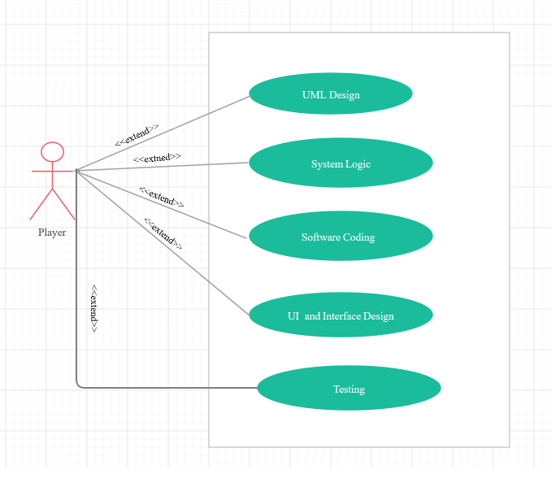

# Design Document

**Author**: Team 71

## 1 Design Considerations

*This is a single player word Android App. A proper GUI pre-design is very
important to realize the design steps moving forward. A GUI could give clear
steps that need to be taken to organize the flow of the program code.*

### 1.1 Assumptions

*This App is designed as a single player word App. This App is designed and will
be coded based on the Android based system. The App will be a major achievement
for us to learn and deploy a game which uses word manipulation to provide
statistics about the word and the frequency of the word.*

### 1.2 Constraints

*The constraints we foresee during this design could be described as the view
layout of the screen and the device screen size. Also, the number of screens and
the parent, children and sibling screen views could complicate or dictate the
flow of the game.*

### 1.3 System Environment

*The system environment we will be using is the JDK 12, Android studio 3.5*

## 2 Architectural Design

### 2.1 Component Diagram

There are five logical unit blocks in our component design. These components
represent a higher abstraction or a check to include all stand alone elements.
The components are “Playr”, “GameSetting”, “Game”, “Board”, and “GameStats”. THe
component Player starts the actions. THe component GameSetting sets the logical
operations for the game. The component Game and Board provide a play ground
operations and display for the game to happen. The components GameStats provide
the logical operations to display the game score. These components are related
by interfaces which are represented by a full circle and a half-circle between
the components.

### 2.2 Deployment Diagram

WordGame is a single player application which can be executed on any android
device and it will be deployed completely on a single device.

## 3 Low-Level Design

This low level design diagram represents our project concept of achieving the
target goal. The UML activity action contains all artifacts of classes,
properties, and methods. The business logic defines the logic involved in
performing actions for the software module and their actions with the activity
players. The software coding action involves programming the GameWord project
with using the ANdroid studio and creating UI interfaces. The activity action
shows the testing part of the process and in our process it is based on the
agile testing procedures.

### 3.1 Class Diagram

### 3.2 Other Diagrams

Activity Diagram:

## 4 User Interface Design

