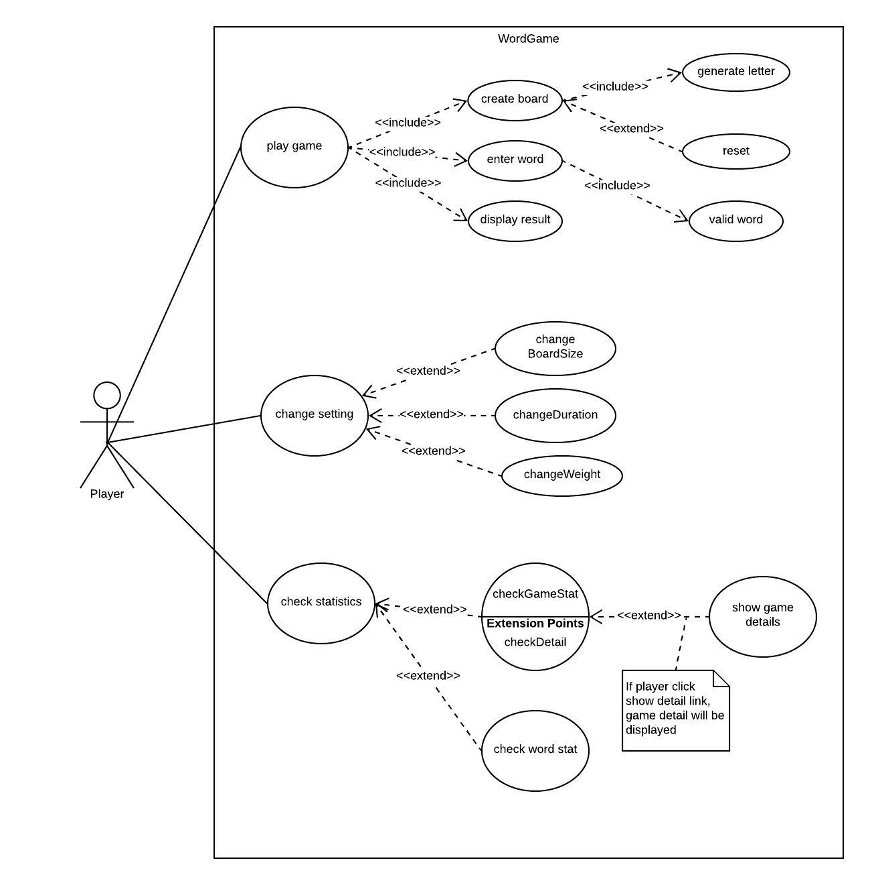
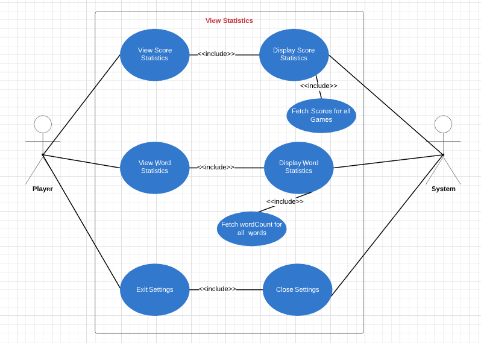
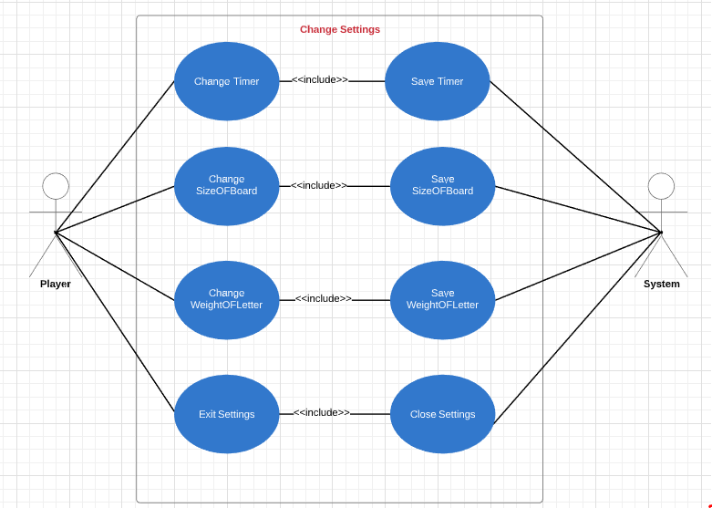
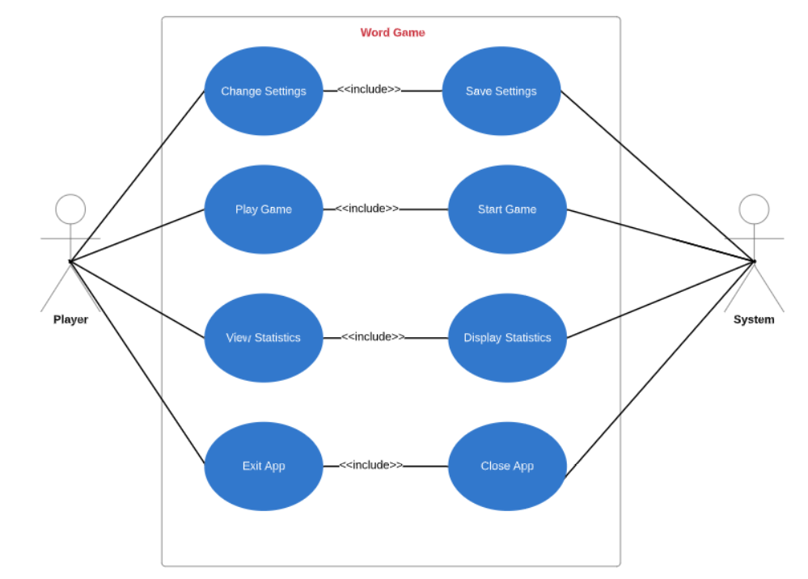

# Use Case Model

**Author**: Team71

## 1 Use Case Diagram

## 2 Use Case Descriptions

### Use Case Scenario 1 : Main Menu

Use Case Description: This is a use case for the main menu. It describes how a
player selects any of the menu items and how the system will respond.

Requirements: This must allow the player to change the settings.

Pre-conditions: All menu items should be available when application is started.

Post-conditions: When the player changes settings, all settings should be saved.

Scenarios:

1.  Player can choose to change the settings and the system will save the
    settings.

2.  Player can choose to start and the system will start the game. After the
    game is over the system will return the Player to the main menu.

3.  Player can choose to view statistics and the system will display the
    statistics.

4.  Player can choose to exit the game and the system will close the
    application.

### Use Case Scenario 2: Change Settings

Use Case Description: This is a use case for Change Settings. This case
describes how a player can change settings and how the system will respond and
saves the settings.

Requirements: The system must allow the Player to change the settings.

Pre-conditions: All menu items in the settings should be available when the
application starts.

Post-conditions: When the Player changes the settings, all settings should be
saved.

Scenarios:

1.  The Player can choose to change the Timer(number of minutes) and the system
    will save the settings. THe Player then can decide to change other settings
    or exit.

2.  The Player can choose to change the size of the Square Board and the system
    will save the settings.

3.  Player can choose to change the weight of the Letter and the system will
    retain the settings. After that the Player can continue with changing other
    settings or can exit the system settings.

4.  Player can choose to exit the settings and will be returned to the Main
    Menu.

### Use Case Scenario 3: Play Game

Use Case Description: This use case is for Playing the Game scenario. This case
scenario illustrates the Player and the system interactions and their
activities.

Requirements: The system must allow the Player to play the game and view the
score at the end of the game turn.

Pre-conditions:

1.  Square Board should be properly displayed with random letters.

2.  Timers should be started either with the default time segment or preferred
    time segment by the Player.

3.  Game Score should start with 0.

Post-conditions: When the Player exits the game, score should be displayed and
the Player should be able to go back to the Main Menu.

Scenarios:

1.  Players can enter words and continue to play until the timer goes off. The
    system will update the timer and score.

2.  Players may use the same letters twice which is not allowed and the system
    should display error messages. Player should be able to continue with other
    words.

3.  Players can reroll the board. System will display the score and the player
    will go back to the Main Menu.

4.  Players can choose to exit the game and the system will display the score.
    The player will be able to go back to the Main Menu.

5.  When the timer goes off, the system will display the final score to the
    Player and go back to the Main Menu.

### Use Case Scenario 4: View Statistics

Use Case Description: This is a use case for view statistics. This case
describes how a player can choose to view the statistics of the words and the
system should respond to all the statistics requests.

Requirements: The system must allow the Player to play the game and view the
score at the end of the game.

Pre-conditions: All game statistics (words and score) should be available for
view.

Post-conditions: When a Player exits the statistics, the Player should be able
to go back to the Main Menu.

Scenarios:

1.  Players can view score statistics and the system will fetch the data and
    display for view.

2.  Players can view word statistics and the system will return the data and
    display.

3.  Players can choose to exit statistics and the system will close the
    statistics view and the Player will be able to go back to the Main Menu.
